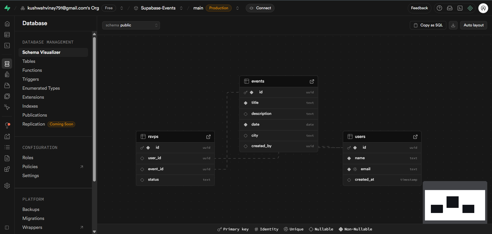

# Database Management Assessment - PixaBeam

This project demonstrates a simple event management platform using **Supabase** as the backend and **Next.js** as the frontend.  
Users can register, create events, and RSVP to events.

## Users Table

| Column Name | Data Type | Nullable | Default |
| ----------- | --------- | -------- | ------- |
| id          | uuid      | NO       | gen_random_uuid() |
| name        | text      | NO       | null |
| email       | text      | NO       | null |
| created_at  | timestamp | YES      | now() |
| is_sso_user | boolean   | NO       | false |
| is_anonymous| boolean   | NO       | false |
... (other columns as per your query output)

## Events Table

| Column Name | Data Type | Nullable | Default |
| ----------- | --------- | -------- | ------- |
| id          | uuid      | NO       | gen_random_uuid() |
| title       | text      | NO       | null |
| description | text      | YES      | null |
| date        | date      | NO       | null |
| city        | text      | YES      | null |
| created_by  | uuid      | YES      | null |

## RSVPs Table

| Column Name | Data Type | Nullable | Default |
| ----------- | --------- | -------- | ------- |
| id          | uuid      | NO       | gen_random_uuid() |
| user_id     | uuid      | YES      | null |
| event_id    | uuid      | YES      | null |
| status      | text      | YES      | null |

## Foreign Keys

- `events.created_by` references `users.id`
- `rsvps.user_id` references `users.id`
- `rsvps.event_id` references `events.id`

## Sample Data

### Users
| id                                   | name       | email             |
| ------------------------------------ | ---------- | ---------------- |
| 831b9c88-9a8a-495b-80dc-b8455e231fcb | Vinay      | vinay@test.com    |
| ...                                  | ...        | ...              |

### Events
| id                                   | title       | date       | city       |
| ------------------------------------ | ---------- | ---------- | ---------- |
| 7ad2b3f0-99d8-4c22-ab77-cae2f3d3db8 | Test Event | 2025-08-25 | Borawan    |

### RSVPs
| id                                   | user_id                              | event_id                             | status |
| ------------------------------------ | ------------------------------------ | ------------------------------------ | ------ |
| 1a2b3c4d-5e6f-7g8h-9i0j-abcdefgh1234 | 831b9c88-9a8a-495b-80dc-b8455e231fcb | 7ad2b3f0-99d8-4c22-ab77-cae2f3d3db8 | Yes    |

## ER Diagram

